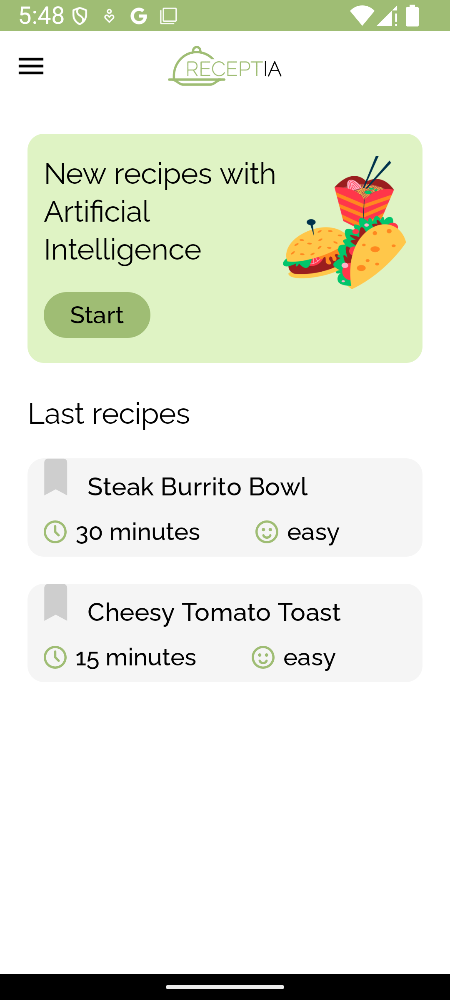
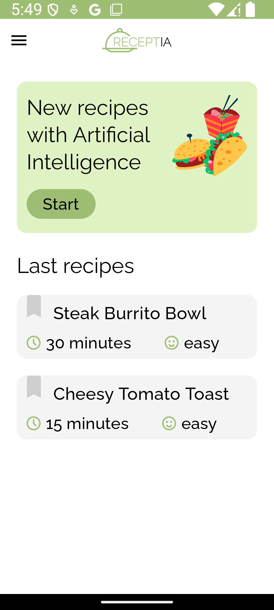
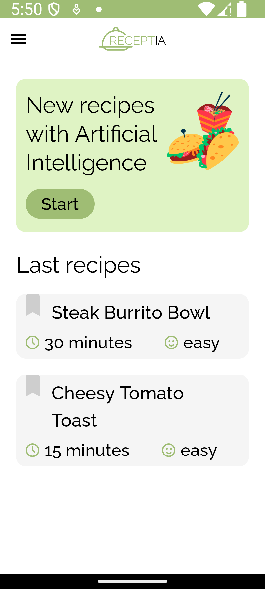
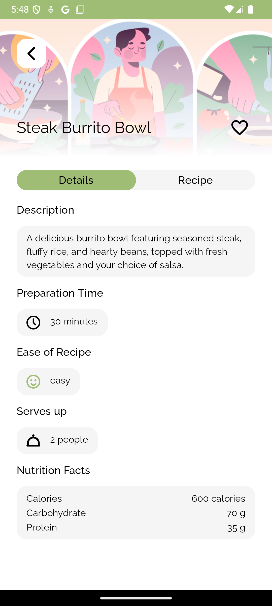
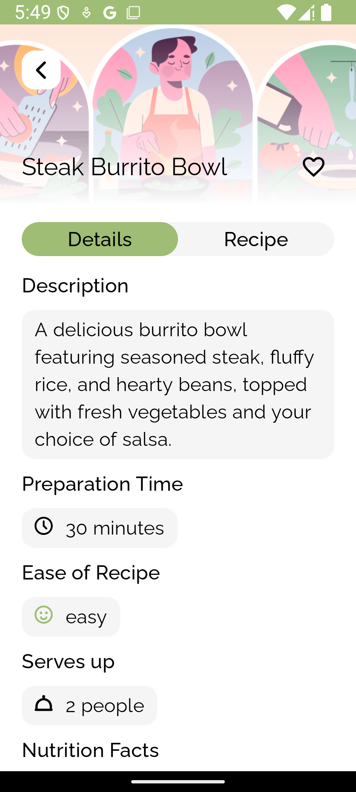
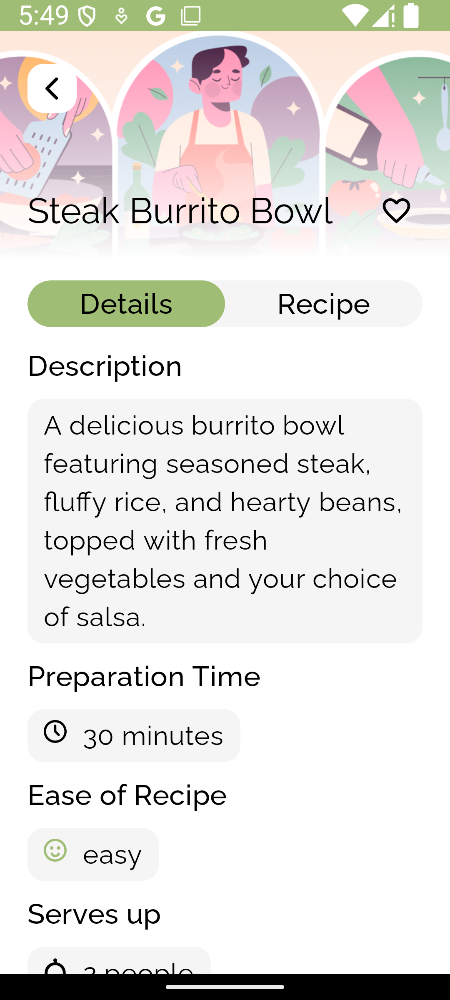
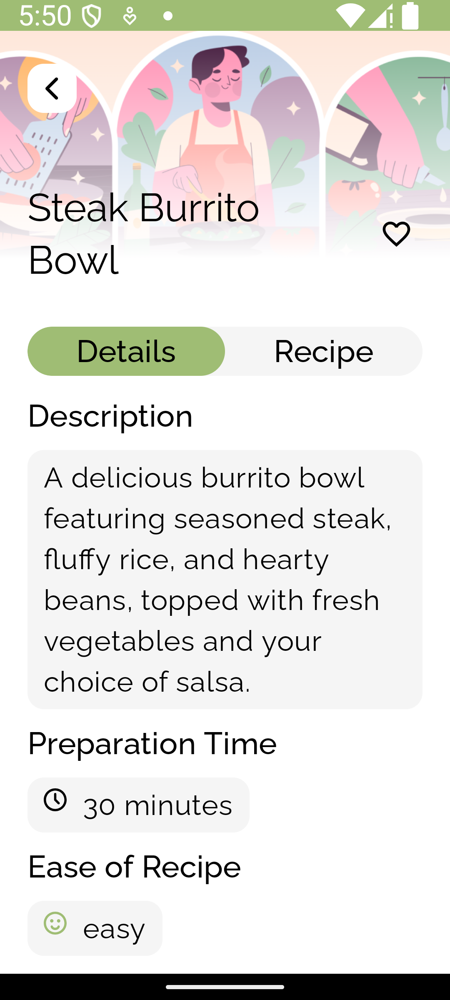

# Accessibility

## Text Scaling

Font scale accessibility in mobile phones allows users to adjust the size of text displayed on their screens, making it easier for them to read content comfortably, regardless of their vision abilities.

The Receptia app is designed to support text scaling up to 200%. Below, you can find screenshots of two screens—the Home screen and the Recipe Description screen—showing the app's appearance at the respective text scales: 100%, 150%, 180%, and 200%.

  
  
  
  

  
  
  
  

