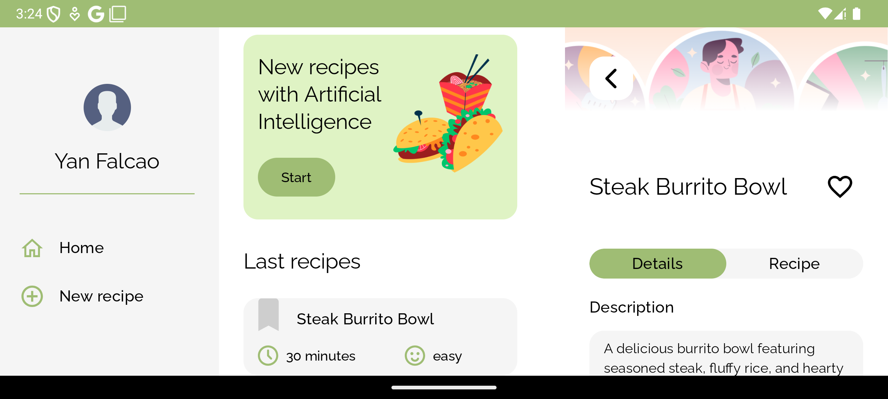
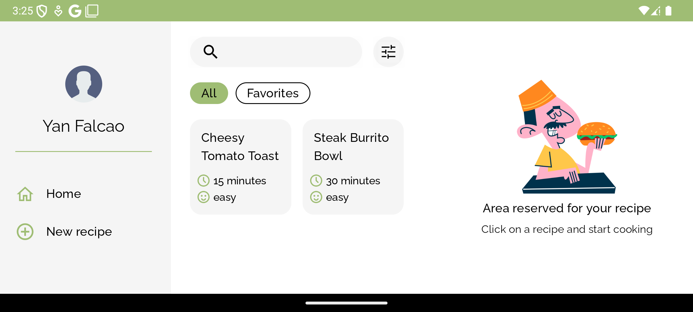
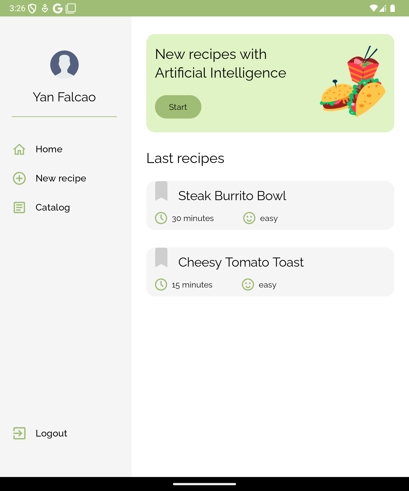
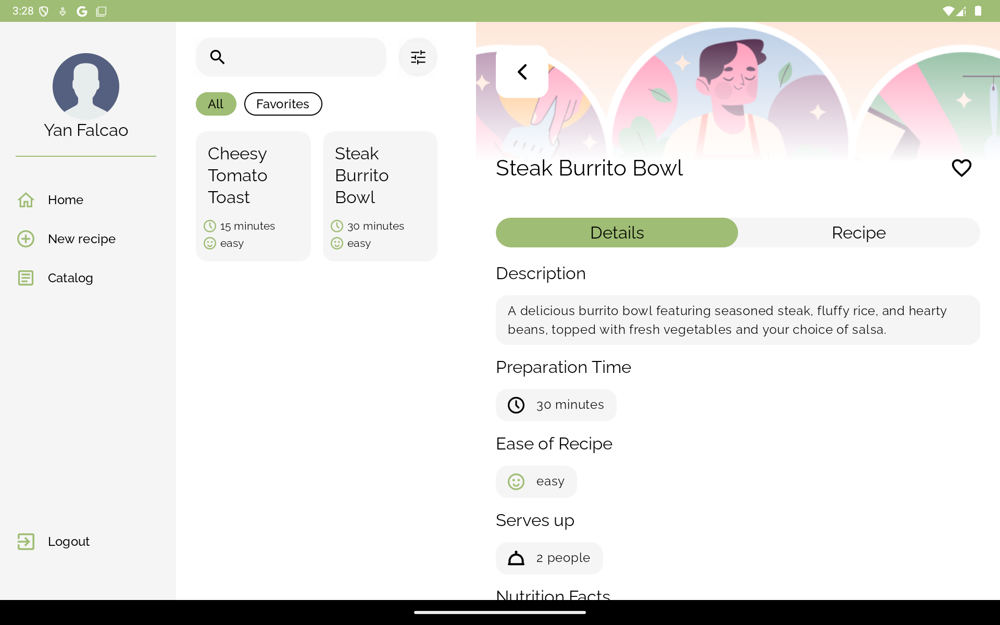
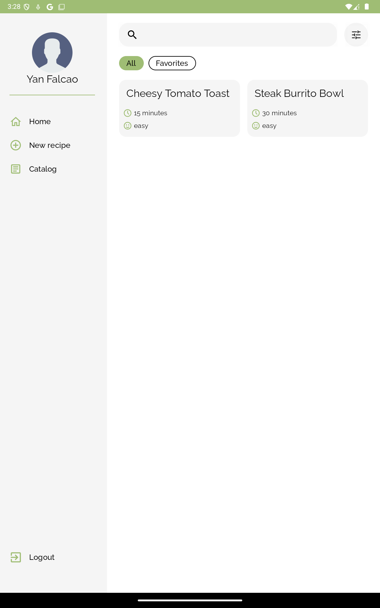

# Responsive Layout

The responsive layout of the **Receptia** app is crucial for providing a seamless user experience across a wide range of device sizes and orientations. We ensure the app adapts fluidly to compact, medium and expanded screens, offering an intuitive interface whether viewed on a smartphone, tablet, or desktop.

## Phone

On phones, the main difference is the layout's support for landscape orientation, where the design takes full advantage of the available width. This is achieved by using a [PermanentNavigationDrawer](https://composables.com/material3/permanentnavigationdrawer) for consistent navigation and a [LisDetailsPaneScaffold](https://developer.android.com/develop/ui/compose/layouts/adaptive/list-detail) to provide an adaptive, two-pane layout.

  
  

 

## Foldable

On foldables, the key difference is the use of the [PermanentNavigationDrawer](https://composables.com/material3/permanentnavigationdrawer) in all orientations, as the screen size is significantly larger compared to a phone in portrait mode.

## Tablet

  
  

